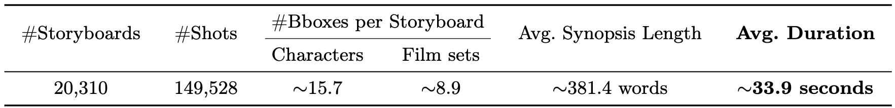
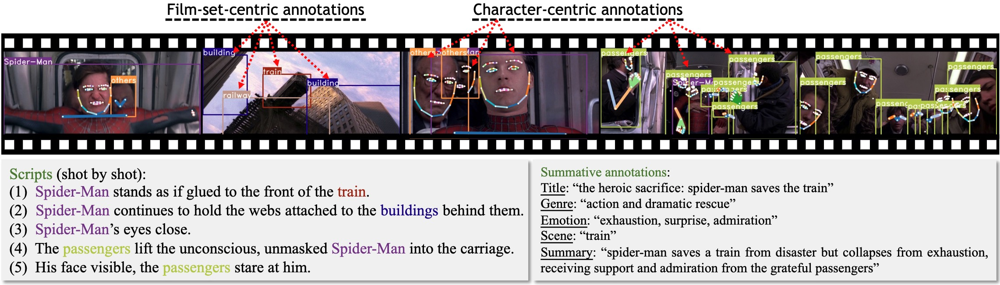

<h1>Long-form Video Prior 🎥 </h1>
<h3>Learning Long-form Video Prior via Generative Pre-Training</h3>

[Jinheng Xie](https://sierkinhane.github.io/)1&nbsp; Jiajun Feng1&#42;&nbsp; Zhaoxu Tian1&#42;&nbsp; Kevin Qinghong Lin1&nbsp; Yawen Huang2 Xi Xia1&nbsp; Xu Zuo1&nbsp; Jiaqi Yang1&nbsp; Yefeng Zheng2&nbsp; [Mike Zheng Shou](https://scholar.google.com/citations?hl=zh-CN&user=h1-3lSoAAAAJ&view_op=list_works&sortby=pubdate)1 

1 National University of Singapore&nbsp; 2 Jarvis Research Center, Tencent Youtu Lab&nbsp;

## Storyboard20K dataset with fine-grained annotations

An overview of the proposed Storyboard20K. It includes around 20K storyboards sourced from MovieNet and LSMDC with around 150K shots (key frames) in total. For each storyboard, there are around 13.8 and 4.7 annotated bounding boxes for characters and film sets, respectively. The average duration of these movie storyboards is around 33.9 seconds, which ensures long-time coverage and large view variation.

### Data samples

Annotated samples (part of a storyboard) of the proposed Storyboard20K. Our dataset involves three main annotations, i.e., (i) character-centric (whole body keypoints and bounding boxes), (ii) film-set-centric (bounding boxes), and (iii) summative (texts) annotations. It also includes condensed or shot-by-shot descriptions.

