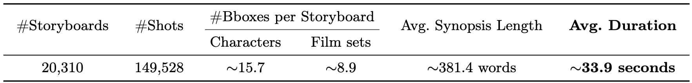
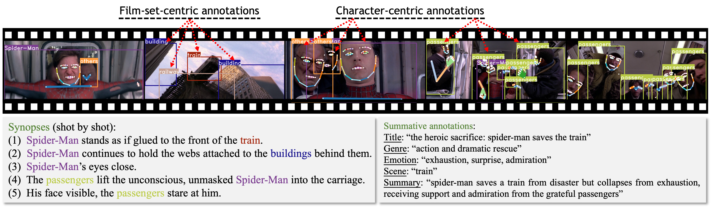

<div align="center">
<h1>Long-form Video Prior 🎥 </h1>
<h3>Learning Long-form Video Prior via Generative Pre-Training</h3>

[Jinheng Xie](https://sierkinhane.github.io/)<sup>1</sup>&nbsp; Jiajun Feng<sup>1&#42;</sup>&nbsp; Zhaoxu Tian<sup>1&#42;</sup>&nbsp; [Kevin Qinghong Lin](https://qinghonglin.github.io/)<sup>1</sup>&nbsp; Yawen Huang<sup>2</sup> Xi Xia<sup>1</sup>&nbsp; Nanxu Gong<sup>1</sup>&nbsp; Xu Zuo<sup>1</sup>&nbsp; Jiaqi Yang<sup>1</sup>&nbsp; [Yefeng Zheng](https://scholar.google.com/citations?user=vAIECxgAAAAJ&hl=zh-CN)<sup>2</sup>&nbsp; [Mike Zheng Shou](https://scholar.google.com/citations?hl=zh-CN&user=h1-3lSoAAAAJ&view_op=list_works&sortby=pubdate)<sup>1</sup> 

<sup>1</sup> National University of Singapore&nbsp; <sup>2</sup> Jarvis Research Center, Tencent Youtu Lab&nbsp;

[]()

</div>


## Updates
* The paper and dataset will be released soon.


## Storyboard20K dataset with fine-grained annotations

An overview of the proposed Storyboard20K. It includes around 20K storyboards sourced from MovieNet and LSMDC with around 150K shots (key frames) in total. For each storyboard, there are around 15.7 and 8.9 annotated bounding boxes for characters and film sets, respectively. The average duration of these movie storyboards is around 33.9 seconds, which ensures long-time coverage and large view variation.

### Data samples

Annotated samples (part of a storyboard) of the proposed Storyboard20K. Our dataset involves three main annotations, i.e., (i) character-centric (whole body keypoints and bounding boxes), (ii) film-set-centric (bounding boxes), and (iii) summative (texts) annotations. It also includes condensed or shot-by-shot descriptions.

### Download 
**The annotation can be downloaded from [here]() and is structured as follows:**
```
# each storyboard in train.json and test.json has the following elements
{   
    'flag': 'train' ('val', 'testA', or 'testB'),
    'global_id': ,
    'movie_id': ,
    'key_frames': ,
    'resolution': ,
    'title': ,
    'genre': ,
    'emotion': ,
    'scene': ,
    'summary': ,
    'cast': ,
    'main characters': ,
    '#characters': ,
    'synopses': ,
    
     # a list of N (#frames of the current storyboard) sub-lists and each sub-list contains M bounding boxes formatted in [x1, y1, x2, y2], 
     # in which each coordinate is scaled into [0,1] by dividing the long side of the frame (max(H,W)).
    'bboxes_person': ,
    'bboxes_object': ,
    'keypoints': ,
}
```
**Visualize storyboards**
```
python data_preprocess.py --input-path path/to/json/file --num-instructions 1 --vis-save-dir outputs/debug --instruct --save-flag instruct --vis-storyboard --max-frames 11
```
The visualized storyboards will be stored at `outputs/debug`.

**Source Movie Frames**

Please make sure to request access to the [MPII Movie Description dataset (MPII-MD)](https://www.mpi-inf.mpg.de/departments/computer-vision-and-machine-learning/research/vision-and-language/mpii-movie-description-dataset/request-access-to-mpii-movie-description-dataset/) first and cc the approval email to sierkinhane@gmail.com. Once you have received approval, I will provide you with the link to download the pre-processed movie frames of Storyboard20K.

[//]: # (## Citation)

[//]: # (If you find our work inspiring or use our dataset or codebase in your research, please consider giving a star ⭐ and a citation.)

[//]: # (```)

[//]: # (```)
